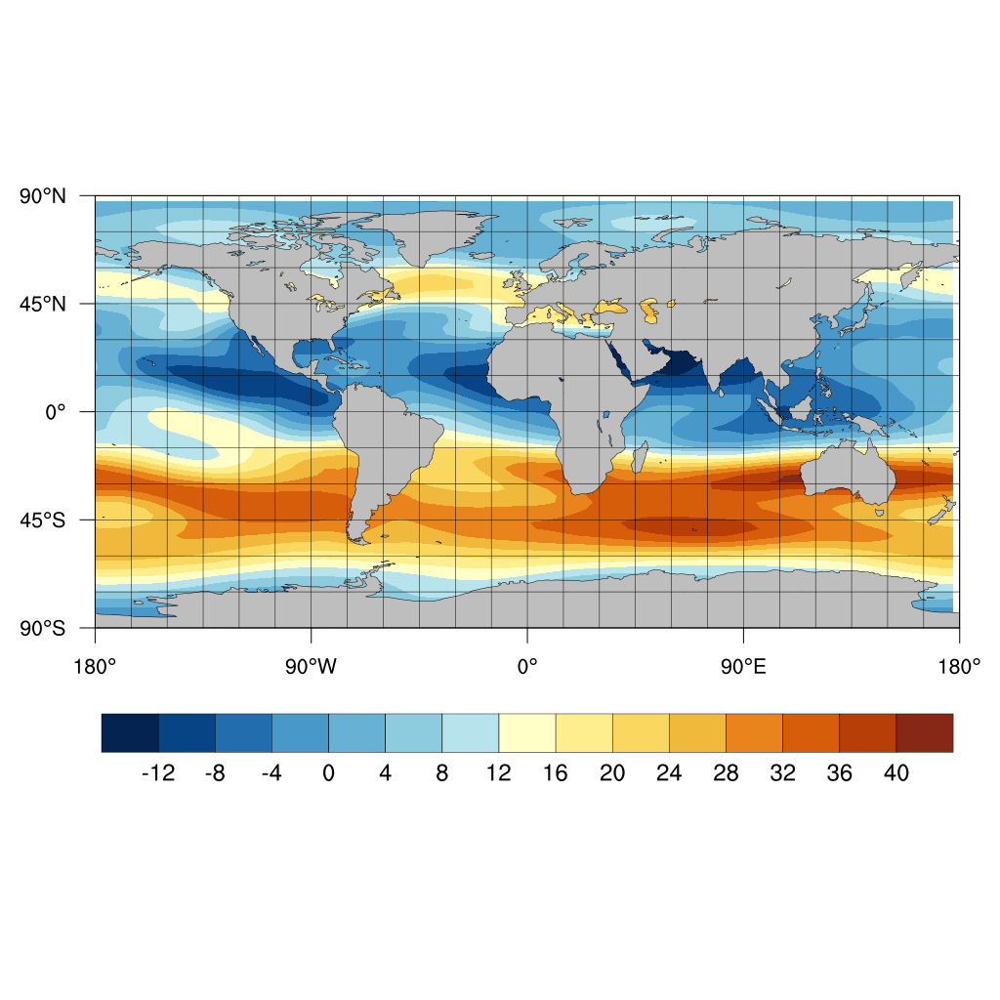

**IPython Examples**
<br> - *a comprehensive gallery for IPython and Jupyter Notebook components*

The repository contains the following examples:
* `Matplotlib`
  - A gallery showing different colormaps, shading and interpolation methods
* `Numpy`
  - Some commonly-made mistakes by Numpy beginners
* `Seaborn`
  - A scientific plot demonstration using examples from
      *Python Data Science Handbook*
* `Vincent`, `Basemap`, and `PyNGL`
  - Topography and global shoreline database in Python
* Some performance tests with Multi-Threading, Numba, and Cython
    (still in beta version)
* Animated GIF
  - Create animations in Python, using the Lorenz Attractor as an example

Most of the ideas were inspired by Oluwaseun Fadugba's studies.

---

**Example Output**

* Relief map created with the `Basemap` module
  ```
  Cleaning previous output...
  ```
  
  ```
  File saved as: ./output/basemap_module/MyProfileName.png
  ```
* Topography with different colormaps (`vincent_gallery.ipynb`)

  
  ```
  File saved as: ./output/basemap_module/vert_RdYlBu_r.png
  CPU times: user 4.19 s, sys: 478 ms, total: 4.67 s
  Wall time: 4.05 s
  ```
* GMT-style maps created in Python (`ngl_examples.sh` and `basemap_module.ipynb`)
  
  

* Computing *pi* using the Chudnovsky Algorithm
  ```
  PI(maxK=70 iterations, gc().prec=1008, disp=1007 digits) =
  3.1415926535897932384626433832795028841971693993751058209749445923078164062
  862089986280348253421170679821480865132823066470938446095505822317253594081
  284811174502841027019385211055596446229489549303819644288109756659334461284
  756482337867831652712019091456485669234603486104543266482133936072602491412
  737245870066063155881748815209209628292540917153643678925903600113305305488
  204665213841469519415116094330572703657595919530921861173819326117931051185
  480744623799627495673518857527248912279381830119491298336733624406566430860
  213949463952247371907021798609437027705392171762931767523846748184676694051
  320005681271452635608277857713427577896091736371787214684409012249534301465
  495853710507922796892589235420199561121290219608640344181598136297747713099
  605187072113499999983729780499510597317328160963185950244594553469083026425
  223082533446850352619311881710100031378387528865875332083814206171776691473
  035982534904287554687311595628638823537875937519577818577805321712268066130
  01927876611195909216420198938095
  CPU times: user 37.4 ms, sys: 705 µs, total: 38.1 ms
  Wall time: 40.1 ms
  ```
* Chudnovsky Algorithm accelerated with Numba
  ```
  PI(maxK=70 iterations, gc().prec=1008, disp=1007 digits) =
  3.1415926535897932384626433832795028841971693993751058209749445923078164062
  862089986280348253421170679821480865132823066470938446095505822317253594081
  284811174502841027019385211055596446229489549303819644288109756659334461284
  756482337867831652712019091456485669234603486104543266482133936072602491412
  737245870066063155881748815209209628292540917153643678925903600113305305488
  204665213841469519415116094330572703657595919530921861173819326117931051185
  480744623799627495673518857527248912279381830119491298336733624406566430860
  213949463952247371907021798609437027705392171762931767523846748184676694051
  320005681271452635608277857713427577896091736371787214684409012249534301465
  495853710507922796892589235420199561121290219608640344181598136297747713099
  605187072113499999983729780499510597317328160963185950244594553469083026425
  223082533446850352619311881710100031378387528865875332083814206171776691473
  035982534904287554687311595628638823537875937519577818577805321712268066130
  01927876611195909216420198938095
  CPU times: user 996 ms, sys: 39.5 ms, total: 1.04 s
  Wall time: 1.06 s
  ```

* The Mandelbrot set

  
  ```
  File saved as: ./output/perform_test/mandelbrot.png
  CPU times: user 11.8 s, sys: 1.61 s, total: 13.4 s
  Wall time: 13.3 s
  ```
* The Mandelbrot set accelerated with `Numba`

  
  ```
  File saved as: ./output/perform_test/mandelbrot_jit.png
  CPU times: user 13 s, sys: 2.03 s, total: 15 s
  Wall time: 14.8 s
  ```

* Animated Lorenz Attractor (`animated_gif.ipynb`)

  
  ```
  Removing single frames...
  Done. Enjoy the animation.
  ```
